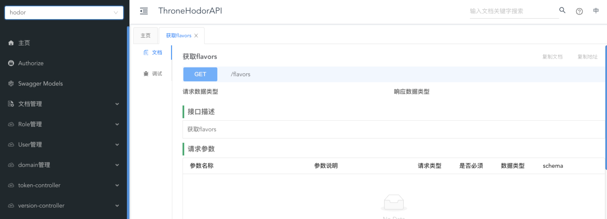
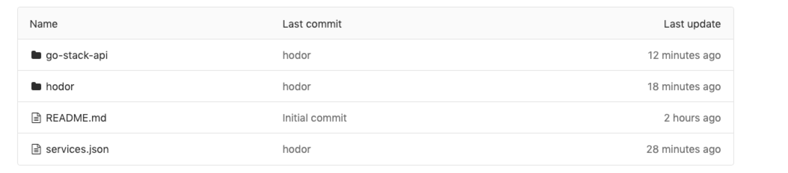

# knife4go-front


## 前言

首先项目是基于knife4j 项目地址为：https://doc.xiaominfo.com/

而knife4go-front的适用范围是，可以生成swagger.json的项目，但是项目本身
并没有使用java或者springboot，这样的项目通过knife4go-front可以结合git仓库
来在不使用knife4j的依赖的同时，却可以使用它的页面来展示api文档

最终的效果:


### 如何配置

#### 配置多项目目录信息(services.json)

这个services.json需要在git上自己创建，如下图所示:



services.json:

```json
[
     {
        "name": "hodor",
        "url": "http://172.28.8.248:10002/gostack/api-doc/raw/master/hodor/hodor.json",
        "swaggerVersion": "2.0"
      }
]
```

name就是左上角的选择项目时的项目名

url是swagger.json的git地址(需要指向该项目的nginx)

swaggerVersion是swagger的版本信息

#### 配置环境变量(编辑.env文件) 
如下图:

```.env
VUE_APP_DOCURL=/gostack/api-doc/raw/master/services.json
```

注意这里配置的地址是git上的services.json的地址（请使用raw的地址,blob地址会带有样式，
是无法正常读取的）


#### 通过nginx解决跨域问题

由于项目直接请求git会存在浏览器跨域问题,所以需要使用nginx代理该
项目静态页面的同时,使用该nginx反向代理访问git，这也是上面services.json
配置的url需要指向项目本身nginx的原因

